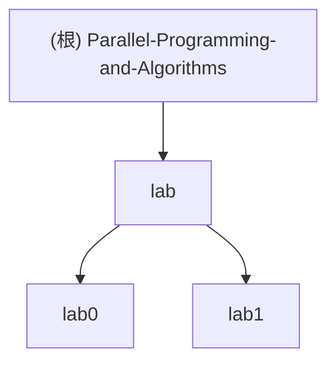

# AGENTS.md

This file provides guidance to Codex (Codex.ai/code) when working with code in this repository.

## 项目愿景

这是一个“Parallel Programming and Algorithms”课程仓库，当前重点包含两个实验模块：

- `lab/lab0`：串行矩阵乘法，从 Python 基线逐步过渡到 C++ 优化与 MKL 接口验证。
- `lab/lab1`：MPI 并行矩阵乘法，关注多进程划分、通信与规模扩展表现。

仓库同时保存课程 PDF、PPTX、DOCX 与实验报告产物；这些材料主要用于课程上下文，不是日常代码改动入口。

## 架构总览

### 1. 仓库分层

- 根目录：课程资料与 `lab/` 实验目录。
- `lab/lab0`：串行实现、构建脚本、兼容包装、Docker oneMKL 路径、结果与提交测试。
- `lab/lab1`：MPI 实现、Makefile、benchmark 脚本、结果与报告。

### 2. 跨文件才能看清的关键结构

#### lab0：统一入口 + 多实现版本

`lab/lab0` 不是“每个版本一个独立项目”，而是围绕统一输入/输出协议组织的多版本实现：

- `src/matmul_common.hpp` 统一了参数解析、伪随机矩阵生成、checksum、max_abs 统计与标准输出格式。
- `src/v1_python.py` 是 Python 基线；`v2` 到 `v5` 是渐进式 C++ 优化；`v6_mkl.cpp` 尝试调用 MKL/CBLAS。
- `scripts/run_matrix_mul_unified` 负责版本路由：
  - `v1_python` 走嵌入式 Python 包装；
  - `v2-v5` 走本机二进制；
  - `v6_mkl` 默认走 Docker oneMKL，也可通过 `LAB1_V6_MODE=local` 强制走本机。
- `scripts/run_matrix_mul` 与 `scripts/benchmark_lab1.py` 只是兼容旧文件名的薄包装，真实主入口是 unified 版本。
- `tests/test_submission_finalize.py` 不是数值单元测试，而是提交收尾测试：验证结果文件、兼容入口和 `v6_mkl` 是否出现在报告中。

注意：`lab/lab0` 中多个 README/脚本文件名仍使用 “lab1” 命名，这是历史残留，不代表目录路径错误。实际代码与命令都应以 `lab/lab0` 为准。

#### lab1：MPI 点对点行划分

`lab/lab1` 的 MPI 实现由两部分组成：

- `src/matmul_mpi.hpp` 提供参数解析、矩阵生成、checksum 计算与本地串行核 `local_matmul`。
- `src/mpi_matmul_v1.cpp` 完成 MPI 生命周期与通信流程：
  - rank 0 生成完整矩阵；
  - 按行数将 `A` 切分给各进程；
  - 将完整 `B` 发送给所有进程；
  - 各进程本地计算自己的 `C` 分块；
  - rank 0 收集所有分块并输出统一指标。

`lab1` 的 benchmark 逻辑不在 C++ 中，而在 `scripts/benchmark.py`：它通过 `mpirun` 遍历进程数和矩阵规模，将结果落到 `results/benchmark_results.json` 与 `results/performance_table.csv`。

#### 两个实验的隐式一致性

虽然 `lab0` 与 `lab1` 没有共享同一个头文件，但两边都使用相同风格的固定 seed、矩阵生成规则与 checksum/max_abs 输出协议。这意味着：

- 实验之间的输出字段风格是一致的；
- benchmark 脚本可以只依赖 stdout 键值对，而不必解析复杂日志；
- 当修改实现时，优先保持输出契约稳定，而不是调整展示文本。

## 模块结构图



## 模块索引

| 模块 | 路径 | 语言/技术 | 主要入口 | 测试/验证 | 一句话说明 |
| --- | --- | --- | --- | --- | --- |
| lab0 | `lab/lab0` | Python、C++17、Shell、Docker、MKL | `scripts/run_matrix_mul_unified`、`scripts/build_lab1.sh` | `tests/test_submission_finalize.py`、benchmark 结果文件 | 串行矩阵乘法从基线到优化版的统一实验模块 |
| lab1 | `lab/lab1` | C++17、MPI、Python | `src/mpi_matmul_v1.cpp`、`Makefile`、`scripts/benchmark.py` | benchmark 结果文件 | 通过 MPI 做按行切分的矩阵乘法并行实验 |

## 运行与开发

### lab0 常用命令

注意：文件名中虽然保留了 `lab1` 字样，但实际目录在 `lab/lab0`。

```bash
# 构建本机版本 v2-v6
./lab/lab0/scripts/build_lab1.sh

# 运行单个版本
./lab/lab0/scripts/run_matrix_mul v2_cpp_baseline 512 512 512 20250401
./lab/lab0/scripts/run_matrix_mul_unified v1_python 4 4 4 20250401 --dump

# 运行 v6_mkl（默认 Docker 路由）
./lab/lab0/scripts/run_matrix_mul_unified v6_mkl 512 512 512 20250401

# 若本机具备 MKL，可切换到本机二进制
LAB1_V6_MODE=local ./lab/lab0/scripts/run_matrix_mul_unified v6_mkl 512 512 512 20250401

# 运行统一 benchmark
python3 ./lab/lab0/scripts/benchmark_lab1_unified.py --sizes 512x512x512 1024x1024x1024 --repeat 3 --include-mkl

# 运行兼容 benchmark 包装
python3 ./lab/lab0/scripts/benchmark_lab1.py --sizes 512x512x512 --repeat 1 --include-mkl

# 运行提交测试（单个测试文件）
python3 -m unittest discover -s ./lab/lab0/tests -p 'test_submission_finalize.py'
```

### lab1 常用命令

```bash
# 构建 MPI 可执行文件
make -C ./lab/lab1

# 运行单个 MPI 用例
mpirun -np 4 --oversubscribe ./lab/lab1/bin/mpi_matmul_v1 512 512 512 20250401

# 运行 benchmark（会遍历多个进程数和规模）
python3 ./lab/lab1/scripts/benchmark.py

# 清理构建产物
make -C ./lab/lab1 clean
```

## 测试策略

### lab0

- 以“输出契约 + 结果文件”验证为主，不是细粒度数值单元测试。
- `tests/test_submission_finalize.py` 重点检查：
  - `report_benchmark.json` 与 `report_benchmark.csv` 中包含 `v6_mkl`；
  - 兼容入口 `run_matrix_mul` 可运行；
  - 兼容 benchmark 入口 `benchmark_lab1.py --help` 可调用。
- 数值一致性主要依赖统一 seed、checksum 与 `max_abs`。

### lab1

- 当前没有独立测试目录。
- 质量保障主要依赖：
  - 程序 stdout 的结构化输出；
  - `scripts/benchmark.py` 批量运行后生成的结果文件；
  - 多进程下的 checksum/max_abs 观察。
- 若新增功能，优先补充自动化回归脚本，而不是只更新报告文件。

## 编码规范

- 保持 CLI 输出为稳定的 `key=value` 形式；benchmark 与测试脚本依赖这个契约。
- 维持默认 seed `20250401` 与现有矩阵生成逻辑，避免无必要地破坏跨版本可比性。
- `lab0` 的 C++ 代码基于 C++17；本机构建脚本默认 `clang++`，MPI 模块使用 `mpicxx`。
- 不要把生成物当作源码改动入口：`bin/`、大部分 `report/` 中间产物、课程 PDF/PPTX/DOCX 都应视为派生或参考文件。
- `lab0` 的 Docker 路径仅用于 `v6_mkl` 功能完成与接口验证，不宜直接与宿主机 `v1-v5` 做严格公平性能对比。

## AI 使用指引

- 先判断目标改动属于哪一层：
  - 算法实现：`src/`
  - 路由/构建：`scripts/`、`Makefile`
  - 结果展示：`results/`
  - 报告材料：`report/`
- 在 `lab0` 中，优先改 unified 主入口及真实实现，不要只改兼容包装脚本。
- 在 `lab1` 中，任何 MPI 通信改动都要同时检查：行划分、`MPI_Send/MPI_Recv` 配对、rank 0 汇总输出。
- 修改 benchmark 逻辑前，先确认是否会破坏已有 JSON/CSV 字段；课程报告和测试脚本都可能依赖这些字段。
- 若需要新增自动化验证，优先放到 `lab/lab0/tests/` 或为 `lab/lab1` 新建独立测试脚本，而不是修改现有结果文件。

## 变更记录 (Changelog)

- 2026-04-03T12:40:33: 初始化仓库级 `AGENTS.md`，补充模块索引、Mermaid 结构图、常用命令、高层架构与 AI 协作说明。
